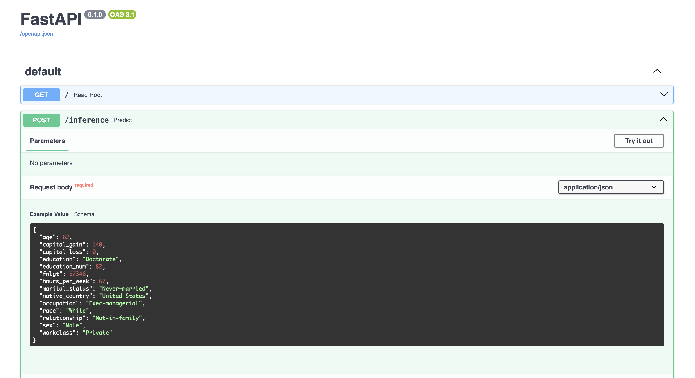

This is my solution to the final project of the Udacitu ML DevOps nanodegree.
In this project, I train a Machine Learning model by following all best practices in order to maintain a clean and easy-deployable project.

<p align="center">
  <a href="https://easybase.io">
    
  </a>
</p>

<br />

## Environment Set up

- Download and install conda if you don’t have it already.
  - Use the supplied requirements file to create a new environment, or
  - conda create -n [envname] "python=3.8" scikit-learn pandas numpy pytest jupyter jupyterlab fastapi uvicorn -c conda-forge
  - Install git either through conda (“conda install git”) or through your CLI, e.g. sudo apt-get git.

## Run Server

The API were created using FastAPI. This allows an easy interaction using the /docs endpoint.
In order to run the server on localhost, we are going to use uvicorn.

1. Enter in the starte/ directory

```
cd starter
```

2. Launch the server with uvicorn

```
uvicorn main:app --host 0.0.0.0 --port 8000 --reload
```

The server will run on your localhost on the port 8000.


# Data

Original data could be found in the data/ subdirectories.
It is a CSV file with more 32K entries and 15 columns
Following a sample of the data.

| age | workclass        | fnlgt  | education | education-num | marital-status     | occupation        | relationship  | race  | sex  | capital-gain | capital-loss | hours-per-week | native-country | salary |
| --- | ---------------- | ------ | --------- | ------------- | ------------------ | ----------------- | ------------- | ----- | ---- | ------------ | ------------ | -------------- | -------------- | ------ |
| 39  | State-gov        | 77516  | Bachelors | 13            | Never-married      | Adm-clerical      | Not-in-family | White | Male | 2174         | 0            | 40             | United-States  | <=50K  |
| 50  | Self-emp-not-inc | 83311  | Bachelors | 13            | Married-civ-spouse | Exec-managerial   | Husband       | White | Male | 0            | 0            | 13             | United-States  | <=50K  |
| 38  | Private          | 215646 | HS-grad   | 9             | Divorced           | Handlers-cleaners | Not-in-family | White | Male | 0            | 0            |

# Model

The trained model is a RandomForset.
A Hyperparameter tuning was run to obtain the best possible model.
The hyperparameters found are:

| Hyperparameter      | Value |
| ------------------- | ----- |
| `max_depth`         | 12    |
| `min_samples_split` | 45    |
| `n_estimators`      | 20    |

# API Deployment

The app is deployed on Heroku
